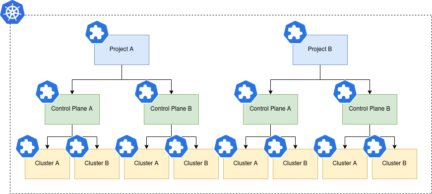
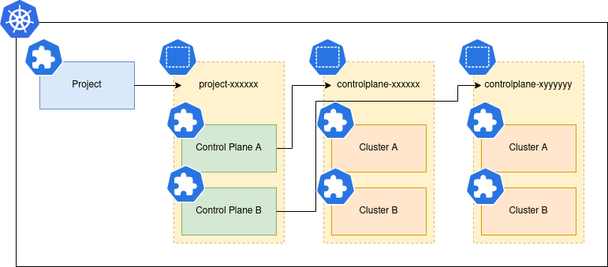

# Unikorn Architecture

Unikorn uses continuous deployment (CD) as the foundation of cluster provisioning.
By itself, CD is not up to the task of Kubernetes cluster provisioning and life-cycle management.
Neither are the methods offered by Cluster API (CAPI).
Unikorn provides the following functionality:

* Application ordering and gating
  * Applications can be deployed in a set order, and only after the previous one is healthy
  * Applications can be deployed concurrently where functionally required, or for performance, all applications must be healthy before execution can continue
* Remote cluster provisionng
  * Applications can be provisioned on a remote cluster e.g. one provisioned by Unikorn
* Dynamic application configuration
  * An opinionated API allows applications to be deployed to user demands
  * Unikorn provides methods to propagate these parameters to the underlying applications
* Provisioning hooks
  * These provide methods to hook into the CD application life-cycle and perform any remidation required due to bugs or deficiencies of the chosen CD backend

In summary, Unikorn is an engine for orchestrating complex CD deployments, that would otherwise be impossible to acheive.

## Unikorn Resources

Unikorn implements cluster provisioning with 3 resources that are nested in the given order:

* Projects encapsulate the relationship between Unikorn and a tenancy on a multi-tenant cloud
* Control Planes encapsulate cluster management e.g. CAPI.
  These are kept deliberately separate from clusters to provide enviroments e.g. production, staging, that can be independently upgraded canary style
* Kubernetes Clusters that actually create an end-user accessible workload clusters

Conceptually these resources form a forest as shown below:

Projects are globally scoped, so one instance of Unikorn is associated with one cloud provider.

Both projects and control planes dynamically allocate Kubernetes namespaces, allowing reuse of names for control planes across projects, and clusters across control planes.
In layman's terms project A can have a control plane called X, and project B can have a control planes called X too.

This is shown below:

Because there are no direct references from, for example, a Kubernetes cluster to its owning project or control plane, these are required to be added as labels.
The labels can be used to construct globally unique fully-qualified names, that include a combination of project, control plane and cluster.

Likewise, the namespaces use generated names, so also need labels to uniquely identify them when performing a lookup operation.
Additionally, namespaces have a kind label, otherwise control plane namespaces will alias with their owning project as the latter's labels are a subset of the former.

## Unikorn Controllers

The controllers (aka operators) used by Unikorn are relatively simple.
They are based upon Controller Runtime and use this library whererver possible, this provides:

* Structured logging
* Caching Kubernetes clients
* Leadership election (to avoid split-brain)
* Monitoring of Unikorn custom resources
* Reconciliation management
  * Filtering of events prevents unwanted reconciliation unless something has actually changed

The core controller code is generic to provide consistency across all controllers.
The general algorithm is:

* Setup the context (detailed below)
* Get the requested resource
  * If not found, it has been deleted so end reconcilliation
* If the deletion timestamp is set, it is being deleted
  * Run the deprovisioner
  * Update the custom resource status conditions
  * If an error occurred, requeue the reconcile, otherwise remove the finalizer to allow deletion and end reconcilliation
* Otherwise we reconcile, either creating or updating resources
  * Add the finalizer to the custom resource if not already set to allow controlled deletion
  * Run the provisioner
  * Update the custom resource status conditions
  * If an error occurred, requeue the reconcile, otherwise end reconcilliation

Like the core controller logic, the reconciler handles status conditions, regardless of the custom resource type, in a generic manner to provide consistency.

## Reconciler Context

The context contains a number of important values that can be propagated anywhere during reconcilliation with only a single context parameter.
These are:

* Logger, provided by Controller Runtime
* A static Kubernetes client that always points to the base cluster Unikorn is running in
* A dynamic Kubernetes client that changes as a result of scope changes (detailed below)
* A CD driver that provides a generic interface to CD backends
* A reference to the controlling object (i.e. the custom resource) used to uniquely identify applications and remote clusters

## Provisioners and Deprovisioners

Everything in Unikorn's provisioning engine implements the Provisioner interface.
This is a very basic contract that says it will provision/deprovision as asked, returning nil, or either an `ErrYield` (meaning the error is expected and transient, and doesn't need to be reflected with an error status), or an actual unexpected error.

### Application Provisioner

This forms the core provisioner of Unikorn, and is responsible for:

* Looking up the application's versioning information e.g Helm repo, chart and version
  * This may also include static configration describing how to provision the application e.g. parameters
* Generating dynamic parameters and values etc from the top level custom resource
* Creating a generic application definition and passing it to the CD driver for provisioning or deprovisioning
* Running any life-cycle hooks, that allow application specific hacks to be performed when the CD is broken in some way

### Remote Cluster Provisioner

Most CD tools allow you to manage applications on a remote Kubernetes instance.
For the most part this requires access to just a Kubernetes configuration file.
The remote cluster provisioner provides a way of managing the lifecycle of remote clusters.

The remote cluster provisioner is just a set of algorithms, to make it work you need to provide it with a driver that is able to retrieve the Kubernetes configuration.

It also doesn't actually implement the Provisioner interface, but acts as a factory that creates them when you wish to provision a child provisioner on the remote cluster.
When invoked, the child will be executed with a new context containing a dynamic Kubernetes client that can directly access the remote cluster, and can be used in application life-cycle hooks.

The remote cluster provisioner will create the remote cluster via the CD driver when first provisioned, and will deprovision it after all children have been deprovisioned.

### Generic Provisioners

These provide the following functionality:

* Serial provisioner
  * Ordered provisioning where one child provisioner is dependant on another
  * It will return nil if all succeed, or the first error that is encountered
  * Deprovisioning will occur in reverse order
* Concurrent provisioner
  * Unordered provisioning where child provisioners can or must be provisioned independently of one another
  * It will return nil if all succeed, or the first error that is encountered
* Conditional provisioner
  * Allows provisioners to be run if a predicate is true
  * Deprovisions if the predicate is false in order to facilitate removal of a single provisioner
* Resource provisioner
  * For those times where you absolutely need to create a resource by hand, as opposed to via Helm
  * Use of this should be restricted

As alluded to generic provisioners operate on other provisioners, thus can be composed into really complex logic that cannot be done with CD tools.
For example, take Kubernetes cluster provisioning, when you create a cluster with CAPI, it will never become healthy until a Cloud Controller Manager (CCM) is installed, and a CNI.
With Unikorn this is simple:

* Create a cluster
* Concurrently...
  * Create a remote cluster when possible (i.e. the kubeconfig is available)
  * On the remote cluster...
    * Create the CCM and CNI concurrently

## CD Drivers

The CD driver does all the heavy lifing of the system, it implements:

* Application creation, update and deletion
* Remote cluster creation and deletion

A CD driver is a provider agnostic interface to application and remote cluster provisioning, thus it's important to only expose functionality things that all backends can implement.

Applications and remote clusters are referred to with an ID.
The ID comprises of a name and an ordered set of labels.
Either the ID's name must be globally unique, or a combination of the name and labels.
This is due to some CD solutions being scoped to a single namespace, and thus we need to consider how to prevent aliasing.

At present only Argo CD is implemented.

### Argo CD Driver

The Argo CD driver assumes that Argo CD is running in namepsaced mode (as opposed to cluster scoped mode), and therefore all applications and remote clusters will be provisioned in the same namespace.

Application names will be generated based on the applicaion ID, so ensure these are kept within the 63 character limit.
Applications are retrieved based on label selectors containing at least the application name.
Applications may have an additional set of labels if the application name isn't unique within the host cluster and can be attached in the ID to ensure uniqueness, e.g. the control plane, project etc.

Remote clusters are handled similarly, using declarative configuration.
For legacy reasons, they will be named in the same way that Argo CD would name the secrets.
The server name, as referred to by applications and as shown in the UI, will be constructed by joining the remote cluster's name, and label values as provided in the remote cluster ID.
Like applications, care should be taken to ensure server names do not alias through either unique names or in conjunction with a unique set of labels.

When provisioning applications, the driver will return `ErrYield` if the application does not report healthy status.

The behaviour is the same when deprovisioning applications, returning `ErrYield` until the application has been full deleted by ArgoCD.
You can enable a feature called "background deletion", which assumes success.
This is typically used when destroying a remote cluster, as the deletion of said cluster will also result in the deletion of all resources, and Argo CD will eventually remove applications referring to a non-existent remote cluster.
